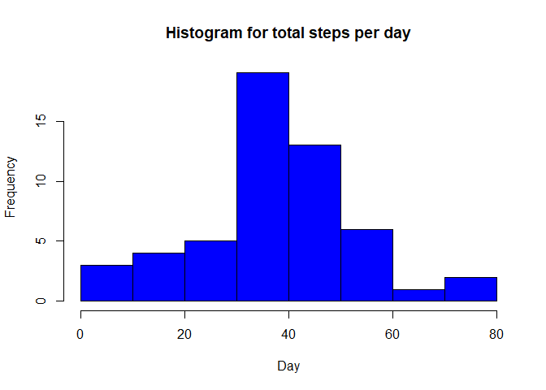
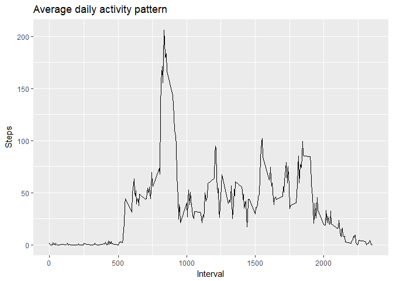
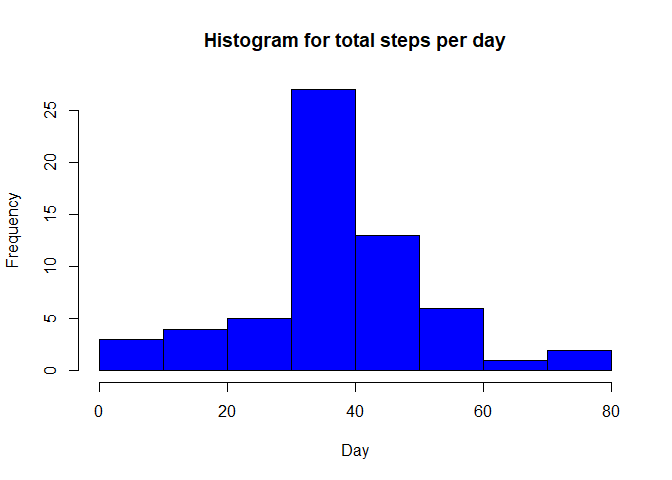
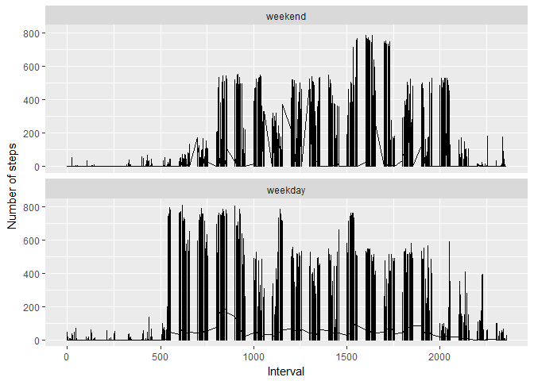

# Reproducible Research: Peer Assessment 1


## Loading and preprocessing the data

```r
activitydata <- read.csv("activity.csv", header=TRUE)
activitydata$date <- as.Date(activitydata$date)
```

## What is mean total number of steps taken per day?

#### Group steps by day

```r
total_steps_per_day <- aggregate(list(steps = activitydata$steps), by=activitydata["date"], FUN=mean, na.rm=TRUE)
```
#### Plot histogram

```r
hist(total_steps_per_day$steps, main = "Histogram for total steps per day", xlab = "Day", col = "blue")
```

<!-- -->
#### Calculate mean and median per day

```r
mean(total_steps_per_day$steps, na.rm = TRUE)
```

```
## [1] 37.3826
```

```r
median(total_steps_per_day$steps, na.rm = TRUE)
```

```
## [1] 37.37847
```
## What is the average daily activity pattern?

```r
daily_activity_pattern <- aggregate(list(steps = activitydata$steps), by=activitydata["interval"], FUN=mean, na.rm=TRUE)

library(ggplot2)
ggplot(data=daily_activity_pattern , aes(interval, steps)) + 
      geom_line() +
      xlab("Interval") + 
      ylab("Steps") +
      labs(title="Average daily activity pattern")
```

<!-- -->

#### The 5-minute interval, on average across all the days in the dataset, contains the maximum number of steps is

```r
daily_activity_pattern$interval[which.max( daily_activity_pattern$steps)]
```

```
## [1] 835
```
## Imputing missing values

#### Calculate and report the total number of missing values in the dataset (i.e. the total number of rows with NAs).All the NAs are located in the steps column because sum(is.na(activitydata))=sum(is.na(activitydata$steps))

```r
  total_number_of_na <- sum(is.na(activitydata))
```

#### Devise a strategy for filling in all of the missing values in the dataset. #The strategy does not need to be sophisticated. For example, you could use the mean/median for that day, or the mean for that 5-minute interval, etc.

#### My answer: To fill in the missing data I will take the mean for that 5-minute interval

#### Create a new dataset that is equal to the original dataset but with the #missing data filled in.

```r
fill_NAs <- numeric()
for (i in 1:nrow(activitydata)) {
  tmp <- activitydata[i, ]
  if (is.na(tmp$steps)) {
    #steps <- daily_activity_pattern[daily_activity_pattern$interval == tmp$interval]$steps
    steps <- subset(daily_activity_pattern, interval == tmp$interval)$steps
  } else {
    steps <- tmp$steps
  }
  fill_NAs  <- c(fill_NAs, steps)
}

complete_activitydata <- activitydata
complete_activitydata$steps <- fill_NAs
```
#### Make a histogram of the total number of steps taken each day and Calculate and report the mean and median total number of steps taken per day. 

```r
new_total_steps_per_day <- aggregate(list(steps = complete_activitydata$steps), by=complete_activitydata["date"], 
                                 FUN=mean, na.rm=TRUE)
mean(new_total_steps_per_day$steps, na.rm = TRUE)
```

```
## [1] 37.3826
```

```r
median(new_total_steps_per_day$steps, na.rm = TRUE)
```

```
## [1] 37.3826
```

```r
hist(new_total_steps_per_day$steps, main = "Histogram for total steps per day",
     xlab = "Day", col = "blue")
```

<!-- -->
#### Do these values differ from the estimates from the first part of the assignment? What #is the impact of imputing missing data on the estimates of the total daily number of steps?

#### My answer: The mean is the same (37.3826) but the median in the first part (37.37847) now coincides with the mean (37.3826).

## Are there differences in activity patterns between weekdays and weekends?

#### I create a new factor variable in the dataset with two levels - weekday and weekend. First I create a vector of weekdays

```r
week_days <- c('Monday', 'Tuesday', 'Wednesday', 'Thursday', 'Friday')
```
#### Then use `%in%` and `weekdays` to create a logical vector, convert to `factor` and specify the `levels/labels`

```r
complete_activitydata$day <- factor((weekdays(complete_activitydata$date) %in% week_days),
                                    levels=c(FALSE, TRUE), labels=c('weekend', 'weekday'))
```
#### Make a panel plot containing a time series plot (i.e. type = "l") of the 5-minute interval (x-axis) and the average number of steps taken, averaged across all weekday days or weekend days (y-axis).

```r
library(ggplot2)
p <- ggplot(data = complete_activitydata, aes(x = interval, y = steps)) + geom_line()
p + facet_wrap(~day, ncol = 1)+ labs(x="Interval", y="Number of steps")
```

<!-- -->
